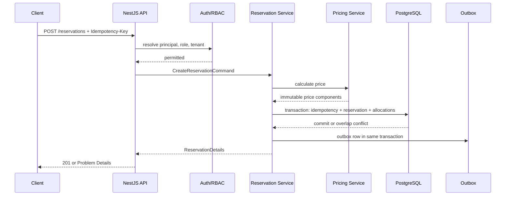

# Visora API — Full Implementation Plan

**Project:** Visora API / BFF  
**Architecture:** Modular Monolith, NestJS, PostgreSQL, REST + WebSocket  
**Contract source:** `openapi.yaml` (OpenAPI 3.1)  
**Scope:** Full implementation of the currently specified API: Auth, RBAC, Reservations, WebSocket, Provider boundary, and production foundations.

---

## 1. Implementation Objective

Implement a production-ready Visora BFF that makes the current OpenAPI contract executable without exposing Gizmo or other Providers to the frontend.

The implementation must guarantee:

- the OpenAPI contract remains the single public API source of truth;
- every tenant-owned operation is scoped by `organization_id` on the server;
- a player cannot access another player’s reservations;
- an Admin is restricted to permitted clubs;
- a reservation conflict cannot commit under concurrent requests;
- retrying a create command cannot create duplicate reservations;
- Provider failures cannot corrupt reservation state;
- WebSocket only notifies clients; REST remains authoritative;
- all administrative and sensitive operations are auditable.

## 2. Scope and Module Boundaries

| Module | MVP responsibility | Must not own |
|---|---|---|
| `auth` | OTP, JWT, refresh tokens, sessions, rate limiting | Organization authorization policy |
| `users` | User profile and identity read model | Roles stored on user record |
| `organizations` | Tenant resolution and membership root | Club-specific operations |
| `roles` | RBAC, memberships, roles, club scopes, invitations | Reservation lifecycle |
| `clubs` | Club data, hours, closures, zone/resource lookup | Provider-specific IDs |
| `reservations` | Availability, booking lifecycle, extensions, participants | Gizmo API details |
| `pricing` | Price resolution and immutable price snapshots | Payment capture in MVP |
| `provider` | Provider Interface, Gizmo adapter, resource bindings/events | Public HTTP contracts of reservations |
| `notifications` | In-app notification commands and deliveries | Reservation ownership rules |
| `realtime` | WebSocket authentication, channels and event fan-out | Persistent business state |
| `analytics` | Aggregate snapshots only | Unlimited raw-event history |
| `common` | Error model, request context, authorization guards, database transaction helpers | Business decisions |

## 3. Contract Decisions to Freeze Before Coding

### 3.1 Canonical source and publication

1. `visora-api/openapi.yaml` is the editable source of truth.
2. `visora-api/docs/openapi.yaml` is generated/published output and must not be manually edited.
3. Every API pull request changes the source contract, DTO implementation, tests, and generated documentation together.
4. CI validates all `$ref` links, duplicate `operationId` values, examples, and breaking changes.

### 3.2 Align API and database vocabulary

Before implementation, lock the shared enum values below. API values are lower `snake_case` in storage and may be mapped to uppercase constants in TypeScript if desired.

| Area | Canonical contract |
|---|---|
| Platform roles | `player`, `platform_admin` (future) |
| Tenant roles | `org_owner`, `club_admin` |
| Reservation statuses | `draft`, `pending`, `confirmed`, `checked_in`, `active`, `completed`, `cancelled`, `rejected`, `expired`, `no_show` |
| Resource types | `computer`, `vip_room` |
| Time intervals | UTC, half-open `[start_at, end_at)` |
| Money | `bigint` minor units internally; decimal-safe string in API payloads |
| Tenant context | Derived on the server; never trusted from request body |

The database design document must be updated to these final role/status names before migrations are started. Existing values such as `OWNER`/`ADMIN` are implementation aliases only and must not become a second public vocabulary.

### 3.3 API compatibility rules

- Additive fields are allowed in `v1` when clients can ignore them.
- Existing fields cannot change type, meaning, required state, or enum values in place.
- Breaking changes require a new API major version or a documented transition period.
- Error handling always uses RFC 9457 Problem Details with stable `code` values.
- Commands that mutate an existing reservation require `If-Match`; creation requires `Idempotency-Key`.

**Exit criterion:** the team has approved one role vocabulary, one reservation state machine, one source OpenAPI file, and a versioning policy.

---

## 4. Delivery Phases

```mermaid
flowchart LR
    A[0. Contract Freeze] --> B[1. BFF Foundation]
    B --> C[2. Database Foundation]
    C --> D[3. Auth]
    D --> E[4. RBAC and Tenant Context]
    E --> F[5. Club and Resource Read Model]
    F --> G[6. Reservations and Pricing]
    G --> H[7. Admin Operations]
    H --> I[8. Provider and Realtime]
    I --> J[9. Quality and Production Readiness]
    J --> K[10. Frontend Integration]
```



Phases may overlap only after their public contracts and data dependencies are stable. Reservation writes must not start before authentication, tenant isolation, role checks, resource lookup, and database conflict protection exist.

---

## 5. Phase 0 — Contract Freeze and API Tooling

### Tasks

1. Add a contract validation command to `visora-api`.
2. Validate OpenAPI 3.1 syntax, all external `$ref`s, response schemas, examples, and operation IDs.
3. Generate an API reference from the root contract into `docs/`.
4. Add a breaking-change check against the main branch contract.
5. Define a contract-review checklist: authentication, permissions, tenant context, idempotency, concurrency, errors, pagination, and examples.
6. Create a shared TypeScript package or generated client types for frontend consumption.
7. Freeze the contract semantics for every existing reservation and session endpoint.

### Deliverables

- Repeatable `api:validate` command.
- Repeatable `api:generate-docs` command.
- Generated TypeScript types/client artifact.
- CI workflow for validation and breaking-change review.
- Written API change policy.

### Acceptance criteria

- The root contract validates with no unresolved references.
- Every operation has a unique `operationId`.
- Every error response references `ProblemDetails` and uses a documented stable code.
- Documentation is generated, not copied by hand.

---

## 6. Phase 1 — NestJS BFF Foundation

### Tasks

1. Create `bff/` as a standalone NestJS TypeScript project.
2. Establish the module structure:

   ```text
   src/
   ├── app/
   ├── common/
   ├── lib/
   ├── modules/
   │   ├── auth/
   │   ├── users/
   │   ├── organizations/
   │   ├── roles/
   │   ├── clubs/
   │   ├── reservations/
   │   ├── pricing/
   │   ├── provider/
   │   ├── notifications/
   │   ├── realtime/
   │   └── analytics/
   ├── types/
   └── mock-db/
   ```

3. Configure TypeScript strict mode, ESLint, Prettier, path aliases, test runners, and environment validation.
4. Implement global HTTP concerns:

   - API prefix `/api/v1`;
   - request/correlation ID middleware;
   - JSON validation pipe;
   - RFC 9457 exception filter;
   - response envelope interceptor;
   - logging with secret/PII redaction;
   - CORS, Helmet, payload-size limits, and compression;
   - health, readiness, and version endpoints outside public business routing.

5. Define module public interfaces and prohibit direct cross-module repository access.
6. Set up configuration namespaces and secret-manager abstraction.
7. Add Docker development environment for API, PostgreSQL, and optional Redis.

### Deliverables

- Runnable BFF with `GET /health` and `GET /ready`.
- Unified success/error envelopes matching OpenAPI.
- Structured logs with `requestId` / `correlationId`.
- Local development compose configuration and `.env.example` without secrets.

### Acceptance criteria

- Invalid input yields contract-compatible `400` Problem Details.
- Unhandled exceptions never expose stack traces or secrets.
- Every request has a traceable correlation identifier.
- CI runs lint, type checks, unit tests, and build.

---

## 7. Phase 2 — PostgreSQL and Persistence Foundation

### Tasks

1. Convert the approved database specification into reviewed, repeatable migrations.
2. Establish the database library and repository convention:

   - tenant context required for tenant-owned queries;
   - explicit transactions for commands;
   - no unscoped repository `findAll` methods;
   - no direct module-to-module writes.

3. Implement UUIDv7 generation, UTC timestamps, soft-delete filtering, and optimistic version updates.
4. Create schema in dependency order:

   1. organizations, users, roles, platform-role assignments, memberships, scopes, refresh tokens;
   2. clubs, working hours, closures, zones, layouts, resources, computers, VIP rooms;
   3. provider connections and resource bindings;
   4. reservations, allocations, participants, extensions, status history;
   5. pricing, discounts, redemptions, price snapshots;
   6. notifications, audit, idempotency, outbox, analytics snapshots.

5. Enforce foreign keys, tenant-consistency checks, partial unique indexes, and soft-delete policies.
6. Implement the active-allocation PostgreSQL exclusion constraint for resource/time overlap.
7. Implement migration locking, seed roles, and separate production database credentials for app, migrations, and retention workers.
8. Add integration test database lifecycle with isolated test schemas/databases.

### Deliverables

- Migration project and baseline schema.
- Seed data for platform roles and development tenant/club/resources.
- Repository transaction helper and tenant-aware query guard.
- Database integration test harness.

### Acceptance criteria

- A child row cannot reference a parent from another organization.
- Two concurrent active allocations for the same resource/time cannot commit.
- Deleted business keys can be reused only where partial uniqueness explicitly permits it.
- Rollback and clean migration from an empty database both succeed.

---

## 8. Phase 3 — Authentication and Session Security

### Tasks

1. Implement the Auth module endpoints from `paths/auth.yaml`:

   - `POST /auth/otp/request`;
   - `POST /auth/otp/verify`;
   - `POST /auth/refresh`;
   - session list, revoke, logout, and logout-all;
   - `GET /me`.

2. Add `otp_challenges` and OTP-attempt persistence or a short-lived Redis-backed equivalent with auditable metadata.
3. Normalize phones to E.164 and prevent account enumeration in OTP request responses.
4. Store only OTP hashes/HMACs, never OTP plaintext.
5. Implement rate limits per phone, IP, and device fingerprint.
6. Create short-lived JWT access tokens with `sub`, `sid`, `iat`, `exp`, `iss`, and `aud` claims.
7. Implement opaque hashed refresh tokens with one-time rotation and token-family replay detection.
8. Use secure HttpOnly cookie delivery for Web; return refresh token body only for the future mobile client flow.
9. Revoke token families on logout-all, user block, detected reuse, and relevant role/security events.
10. Add audit events for session/security actions.

### Deliverables

- Complete Auth endpoints matching schemas/examples.
- JWT guard and request principal abstraction.
- OTP delivery adapter interface with development fake adapter.
- Session management UI-ready APIs.

### Acceptance criteria

- OTP is valid for five minutes, accepts at most five attempts, and is consumed atomically.
- Refresh token reuse revokes the complete token family.
- Blocked/deactivated users cannot acquire or refresh sessions.
- Web refresh token is absent from JSON response body.

---

## 9. Phase 4 — RBAC, Memberships, and Tenant Isolation

### Tasks

1. Implement role catalog and access endpoints from `paths/roles.yaml`.
2. Implement `platform_role_assignments` for `player` and future `platform_admin`.
3. Implement organization memberships, role assignments, club scopes, invitations, accept/decline, update, and removal.
4. Resolve authorization context per request from database or a short-lived revocable cache; never accept it from JWT claims alone.
5. Build declarative permission metadata/guards for `x-permissions` rules in OpenAPI.
6. Implement resource ownership policies:

   - Player reads/mutates only own reservations and own sessions;
   - Club Admin accesses only assigned clubs;
   - Org Owner accesses all clubs in their organization;
   - Platform Admin access is explicit, audited, and future-gated.

7. Enforce `organization_id` on every tenant-owned repository query and command.
8. Add membership and scope changes to audit logs and immediately invalidate authorization cache entries.
9. Add negative authorization test matrix for all endpoints.

### Deliverables

- Functional `/roles`, `/me/roles`, `/me/memberships`, invitation, and member-management endpoints.
- Reusable `@RequirePermission()` guard/decorator or equivalent policy layer.
- Tenant context service and audit integration.

### Acceptance criteria

- A Club Admin cannot read or mutate another club’s reservations.
- An Org Owner can operate all clubs in their organization.
- A Player cannot infer another user’s reservation existence through ID enumeration.
- Revoked membership takes effect without waiting for access-token expiry.

---

## 10. Phase 5 — Clubs, Layouts, Resources, and Availability Read Model

### Tasks

1. Implement internal repositories/services for clubs, working hours, closures, zones, resources, computers, and VIP rooms.
2. Add initial read endpoints required by the reservation frontend, even if they are introduced as the next OpenAPI contract increment:

   - club lookup/catalog;
   - published layout;
   - zones and resource catalog;
   - resource detail and current projected provider state.

3. Validate that every published layout JSON references an active resource of the same club.
4. Build availability query service using:

   - club timezone and working hours;
   - closure intervals;
   - active allocation conflicts;
   - resource status/maintenance;
   - optional provider state freshness.

5. Do not expose raw Provider payloads or credentials in the response model.
6. Cache only non-authoritative catalog/layout reads; include organization/club/version in every cache key.

### Deliverables

- Club/resource read model usable by reservation flows.
- Deterministic availability service.
- Fixtures representing computers, VIP rooms, closures, and maintenance.

### Acceptance criteria

- Availability respects the club’s IANA timezone and closure periods.
- Inactive/maintenance resources cannot be booked.
- A published layout cannot reference a resource from another club.
- Provider staleness is clearly exposed as freshness/status, never silently treated as current truth.

---

## 11. Phase 6 — Reservation Core and Pricing

### Tasks

1. Implement all player reservation operations in `paths/reservations.yaml`:

   - create;
   - list, details, current/upcoming/active/expired views;
   - validation and availability;
   - history, timeline, status, and participants;
   - cancellation;
   - extension request.

2. Implement the reservation state machine and reject invalid transitions.
3. Require and process `Idempotency-Key` for creation.
4. Calculate reservation price through the Pricing module using:

   - club base price;
   - resource override;
   - VIP room price;
   - zone/resource rules;
   - happy hours;
   - discounts.

5. Save immutable reservation totals and price components inside the booking transaction.
6. Create reservation header, allocations, status history, audit row, and outbox event atomically.
7. Implement participant validation: registered users or guests, capacity limits, one primary participant.
8. Add automatic no-show worker:

   - selects confirmed reservations whose `arrival_deadline_at` has passed;
   - transitions them to `no_show` atomically;
   - records status history/audit/outbox;
   - releases occupancy allocations.

9. Add reservation extension request workflow with revalidation and a future-safe data model.
10. Translate PostgreSQL unique/exclusion errors into `409` contract errors such as `RESERVATION_SLOT_CONFLICT`.

### Reservation command flow



### Deliverables

- Complete Player reservation API contract implementation.
- Pricing resolver and immutable price snapshots.
- Idempotency store and conflict protection.
- No-show scheduler/worker.

### Acceptance criteria

- One reservation supports one or many computers, or one VIP room, according to the API rule.
- A duplicate request with the same idempotency key returns the original response.
- A duplicate key with a different payload returns `409 IDEMPOTENCY_KEY_REUSED`.
- Concurrent requests cannot book the same resource interval.
- A reservation not checked in after its ten-minute grace period becomes `no_show` and releases capacity.
- Changing a pricing rule never alters confirmed historical totals.

---

## 12. Phase 7 — Admin Reservation Operations

### Tasks

1. Implement the Admin endpoints from `paths/reservations.yaml`:

   - queue;
   - check-in;
   - reject;
   - complete;
   - expire;
   - move resource;
   - controlled status change;
   - approve/reject extension.

2. Require `If-Match` and enforce optimistic `version` comparison on every admin mutation.
3. Apply club-scope authorization before loading mutable reservation data.
4. On a move, release the old allocation and create a new allocation in one transaction; preserve history instead of editing past allocation facts.
5. Recalculate and snapshot any approved extension cost before changing allocation time.
6. Record audit, status history, and outbox events for every administrative action.
7. Provide clear `409 VERSION_CONFLICT`, `409 RESERVATION_SLOT_CONFLICT`, `403`, and `422` responses.

### Deliverables

- Complete Admin reservation API implementation.
- Optimistic locking middleware/service helper.
- Admin audit/event integration.

### Acceptance criteria

- A stale `If-Match` cannot overwrite a newer reservation state.
- Resource moves cannot create overlapping active allocations.
- Every status override records actor, reason, before/after state, and correlation ID.

---

## 13. Phase 8 — Provider Layer, Outbox, Notifications, and WebSocket

### 13.1 Provider Layer

#### Tasks

1. Define a provider-neutral TypeScript interface:

   - connection health;
   - resource discovery/binding;
   - current resource state projection;
   - future session/lock/unlock commands;
   - inbound event verification and normalization.

2. Implement `GizmoProvider` behind this interface.
3. Store provider configuration only as non-secret configuration plus a secret-manager reference.
4. Implement provider event ingestion with signature validation, idempotency by external event ID/payload hash, bounded retention, and retries.
5. Never allow the Reservation module to import Gizmo SDK/types directly.
6. Make provider network calls asynchronous after transaction commit unless a business operation explicitly requires synchronous confirmation.

### 13.2 Transactional Outbox

#### Tasks

1. Write outbox events in the same transaction as reservation, auth-security, and membership domain changes.
2. Implement a publisher worker with leases, retries, backoff, metrics, and idempotent consumers.
3. Version event names, for example `reservation.created.v1`.
4. Publish to WebSocket, notifications, and analytics projectors through events rather than direct controller calls.

### 13.3 WebSocket

#### Tasks

1. Implement `/api/v1/ws` with the documented bearer subprotocol authentication.
2. Implement heartbeat, ping/pong timeout, reconnect behavior, subscribe/unsubscribe, and resume window.
3. Authorize each channel subscription:

   - `user.{userId}` only for that same user;
   - `club.admin.{clubId}` only for permitted club staff/owners.

4. Validate event envelope versions and never send unredacted internal payloads.
5. Retain resumable events for five minutes in Redis or another bounded transient store.
6. Ensure client reconnects recover authoritative state through REST if resume is unavailable.

### 13.4 Notifications

#### Tasks

1. Create in-app notifications from outbox consumers.
2. Store logical notification and channel delivery state separately.
3. Add push/SMS/email adapter interfaces only; actual external delivery may remain feature-flagged in MVP.
4. Ensure notification failure never rolls back a completed reservation transaction.

### Deliverables

- Provider Interface and Gizmo adapter skeleton/integration.
- Reliable outbox publisher.
- Contract-compatible WebSocket gateway.
- In-app notification event consumer.

### Acceptance criteria

- Provider downtime does not leave partially written reservations.
- The same provider webhook is processed once logically.
- Unauthorized WebSocket channel subscriptions are rejected.
- A WebSocket reconnect after the resume window restores state by REST without data corruption.

---

## 14. Phase 9 — Analytics, Observability, Security, and Operations

### Analytics

1. Produce aggregate snapshots from outbox/domain events, not dashboard scans over raw reservations.
2. Retain analytics snapshots for one month as specified.
3. Add idempotent aggregation keys and source watermark tracking.
4. Keep PII out of snapshots.

### Observability

1. Add structured logs, metrics, traces, and dashboards for:

   - request latency/error rate;
   - OTP send/verify and rate limits;
   - token refresh/reuse events;
   - reservation creation/conflicts/no-shows;
   - provider latency/failures/event lag;
   - outbox queue age/failures;
   - WebSocket connections/subscriptions/reconnects;
   - PostgreSQL pool usage, slow queries, locks, and dead tuples.

2. Propagate `correlationId` through HTTP, database audit, outbox, worker, provider, and WebSocket event paths.
3. Configure error reporting with PII scrubbing.

### Security

1. Enforce TLS, security headers, CORS allowlist, input-size limits, and rate limiting.
2. Encrypt provider secrets through a secret manager/KMS; never persist raw credentials.
3. Hash refresh tokens, OTPs, idempotency request hashes, device/user-agent signals where appropriate.
4. Redact secrets, OTPs, cookies, phone numbers, and provider payloads from logs/audit where not required.
5. Apply least-privilege database roles and protect migrations/audit retention jobs separately.
6. Add dependency, secret, and container vulnerability scanning to CI.

### Operations

1. Create Docker images and deployment manifests.
2. Configure environment promotion: local → staging → production.
3. Establish PostgreSQL backup, WAL archiving, restore test, and retention jobs.
4. Add readiness gates for migrations and provider health without making provider availability a hard dependency for all API reads.
5. Document incident playbooks for token compromise, provider outage, reservation conflict spikes, and failed migrations.

### Acceptance criteria

- A failed worker action is retried safely and visible in metrics.
- Production restores are rehearsed successfully.
- Secrets and raw refresh tokens do not appear in logs, database records, or API payloads.
- The system remains operational for existing data when a Provider is degraded.

---

## 15. Phase 10 — Frontend Integration and End-to-End Acceptance

### Tasks

1. Generate or publish a typed API client from the contract for the Next.js frontend.
2. Replace mock data through a feature flag, domain by domain.
3. Integrate TanStack Query with request IDs, retry rules, invalidation from mutation success, and WebSocket event reconciliation.
4. Use REST refetch after WebSocket reconnect or unknown event version.
5. Implement authenticated route/session refresh handling without exposing refresh token to browser JavaScript.
6. Build end-to-end scenarios using a seeded club and fake Provider.
7. Validate mobile web flows on poor network conditions, duplicated submits, background/foreground transitions, and WebSocket reconnects.

### End-to-end scenarios

| Scenario | Expected result |
|---|---|
| New player OTP login | User receives session; no account enumeration |
| Select resource and create booking | One reservation, price snapshot, event and notification created |
| Double tap/Create retry | One reservation only; original response is returned |
| Concurrent booking same PC | One succeeds; other receives `409 RESERVATION_SLOT_CONFLICT` |
| Player opens another user reservation ID | `404` or `403` without information leak |
| Admin from different club attempts check-in | `404` or `403`; no state change |
| No arrival after 10 minutes | Reservation moves to `no_show`; resource becomes available |
| Admin moves reservation | Old allocation released, new allocation created, audit/event emitted |
| Refresh token replay | Token family revoked; user must authenticate again |
| WebSocket disconnect/reconnect | Client resumes or re-fetches REST truth |
| Provider outage | Booking rules remain consistent; provider state marked degraded/stale |

### Acceptance criteria

- Frontend TypeScript compilation catches contract mismatches.
- All listed end-to-end scenarios pass in CI/staging.
- Mock mode and API mode produce the same user-facing state semantics.

---

## 16. Test Strategy

| Layer | Purpose | Examples |
|---|---|---|
| Unit | Pure business rules | pricing resolution, state transitions, permission policy |
| Repository integration | PostgreSQL behavior | exclusion conflict, partial uniqueness, tenant composite FKs |
| Module integration | Command transaction behavior | booking writes reservation/allocation/audit/outbox together |
| Contract | OpenAPI compatibility | response schema, error shape, required headers |
| API integration | HTTP guards and serialization | OTP limits, `If-Match`, idempotency behavior |
| WebSocket integration | Channel authorization and envelope | forbidden subscription, resume window |
| Provider adapter | External boundary resilience | signature validation, timeouts, duplicate webhooks |
| End-to-end | User business journeys | player booking, admin check-in, no-show |
| Load/concurrency | Contention and capacity | simultaneous booking same PC, connection pool pressure |
| Security | Abuse resistance | IDOR, privilege escalation, cookie/token handling, rate limit bypass |

Minimum quality gates:

- 100% coverage of reservation state transitions and authorization policies;
- integration tests for every critical database constraint;
- contract test per public operation;
- no critical/high unresolved security findings before production;
- load test evidence for expected launch traffic and peak booking contention.

---

## 17. Definition of Done

The current API specification is fully implemented when all of the following are true:

- Every documented Auth, Roles, Reservations, and Admin Reservations operation is available and contract-tested.
- All request/response/error payloads validate against the root OpenAPI contract.
- OTP, session rotation, logout, session revocation, and `/me` work on web and future mobile token delivery paths.
- Platform roles, memberships, invitations, organization roles, and club scopes enforce authorization on every endpoint.
- Reservation creation is idempotent, tenant-safe, priced, audited, evented, and transactionally protected from overlaps.
- Player and Admin reservation reads/writes obey ownership and club scope.
- Check-in, cancellation, completion, expiration, no-show, moves, and extension approvals preserve complete history.
- PostgreSQL is the final authority for active allocation conflicts.
- Provider access is behind a provider-neutral interface, with Gizmo isolated in its adapter.
- Outbox, WebSocket, notification, and analytics consumers are idempotent and recover after restarts.
- Observability, backups, migrations, security controls, and incident runbooks have been tested in staging.
- The Next.js frontend consumes typed contracts and passes end-to-end acceptance scenarios without mock data.

---

## 18. Recommended Execution Order

| Order | Work package | Dependency |
|---:|---|---|
| 1 | Contract validation and vocabulary alignment | None |
| 2 | NestJS foundation and CI | Contract conventions |
| 3 | PostgreSQL baseline and migration infrastructure | Database design approval |
| 4 | Auth and session security | Foundation + persistence |
| 5 | RBAC, memberships, tenant context | Auth + persistence |
| 6 | Clubs/resources read model and availability | Tenant context + persistence |
| 7 | Reservation creation, price snapshots, idempotency | Resources + RBAC + database exclusion constraint |
| 8 | Player reservation queries and lifecycle | Reservation core |
| 9 | Admin reservation commands and extension approval | Reservation core + RBAC |
| 10 | Outbox, Provider boundary, WebSocket, notifications | Transactional domain commands |
| 11 | Analytics snapshots and retention | Outbox |
| 12 | Frontend integration, E2E, staging hardening | All API modules |
| 13 | Production readiness and rollout | Staging acceptance |

No phase is considered complete solely because endpoints return `200`. Completion requires contractual correctness, authorization, transactional safety, observability, and automated tests.

